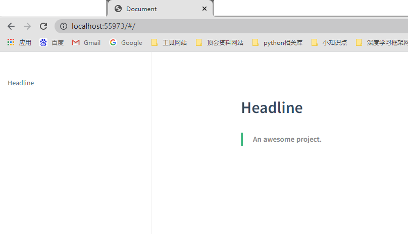

## 1.构建文档空间

前面，我们完成了`docsify`的下载，这部分我们将利用`docsify`进行**文档的创建**以及**基本的配置**，从而方便后期我们进行静态文档的**编写与阅读**。

首先，我们了解以下如何创建一个`docsify文档`。

> PS: 输入以下指令即可创建`docs`文档目录

```bash
# docsify: 工具的名称
# init: 工具执行的功能指令--初始化创建一个文档
# ./docs: 表示在当前目录进行初始化创建
# 综上: 在当前目录创建了一个docs文件夹作为文档目录
docsify init ./docs
```

输入**初始化指令**


初始化后的**目录结构**


`docs`中的初始化文件


> 我们在后边去介绍这三个文件的作用~，这里只需要知道这三个文件是初始化生成的就可以了

## 2.启动docsify服务

我们尝试着运行一下我们现在初始化后的文档，可以看到最初的文档效果~

在当前目录下运行指令`docsify serve ./docs`从而启动文档渲染服务，从而进行文档预览。

> - `serve`: 启动服务的指令
> - `./docs`: 以指定路径为文档路径进行服务


执行服务指令后, 可以通过浏览器输入上边的: `http://localhost:55973`

> 上边类似网址一样的，是`docsify`服务所使用的服务端口，只有通过这里才能访问我们当前编写的这个文档。
>
> 服务端口一般为`3000`这些，但是**不是一成不变的**——当我们同时启动多个docsify服务，开启多个文档服务时，就会有**多个不同**的端口被被调用。

这是输入**当前的服务端口**后的效果。




上面浏览器所显示的内容其实是初始化文档目录中的README.md内容~

> PS: `docsify`一个优势就是利用本地目录中的一些`Markdown文件`生成相应的**静态文档**，但是由于是**实时渲染**，不会产生html文件等。

**后面，我们还将学习怎么去添加文档的内容以及一些常用插件~**

不过，在这一节，我们还需要再深入了解一下**文档结构**，以方便我们后边进行**文档组织**。

## 3.基本文档结构

上面我们通过`docsify init ./docs`创建了一个初始化的文档以供后期开发，里面包含3个初始文件，分别是: `.nojekyll`, `index.html`, `README.md`。

```bash
- .nojekyll: 用于github部署pages服务时不忽略一些以下划线开头的文件，eg: `_sidebar.md`
- index.html: 文档服务的`启动接口`，也就是整个文档浏览都是从这里开始的
- README.md: 整个文档的介绍页面内容/主页面内容——服务一经启动，首先浏览到的就是这个Markdown文件中的内容
```

我们来整理一下可能的理解思路:

```mermaid
graph LR;
	subgraph docsify_process
	id1[docsify_init_./docs] --> id2(./docs);
	id2 --> id3([.nojekyll]);
	id2 --> id4([index.html]);
	id2 --> id5([README.md]);
	end
	
	subgraph docsify_work_info
	id6[docsify_serve_./docs] --启动serve--> id7([index.html]);
	id7 --> id8[用于渲染生成文档浏览的界面的html文件];
	
	id9[docsify_serve_./docs] --启动serve--> id10([README.md]);
	id10 --> id11[文档的首页内容];
	
	id12[docsify_serve_./docs] --启动serve--> id13([.nojekyll]);
	id13 --> id14[避免github等渲染引擎忽略docsify文档项目中一些下划线文件 eg: _sidebar.md等]
	end
	
	subgraph docsify_process
	id3 --serve--> id15[启动服务端口, 渲染生成文档页面]
	id4 --serve--> id15
	id5 --serve--> id15
	end
```

通过上边`mermaid`图，大家可能更清晰了初始化文件的作用，但是也许还是有些模糊。

后面的内容，我们就从具体的文件内容到**效果的展示**，来分析对应的作用吧。