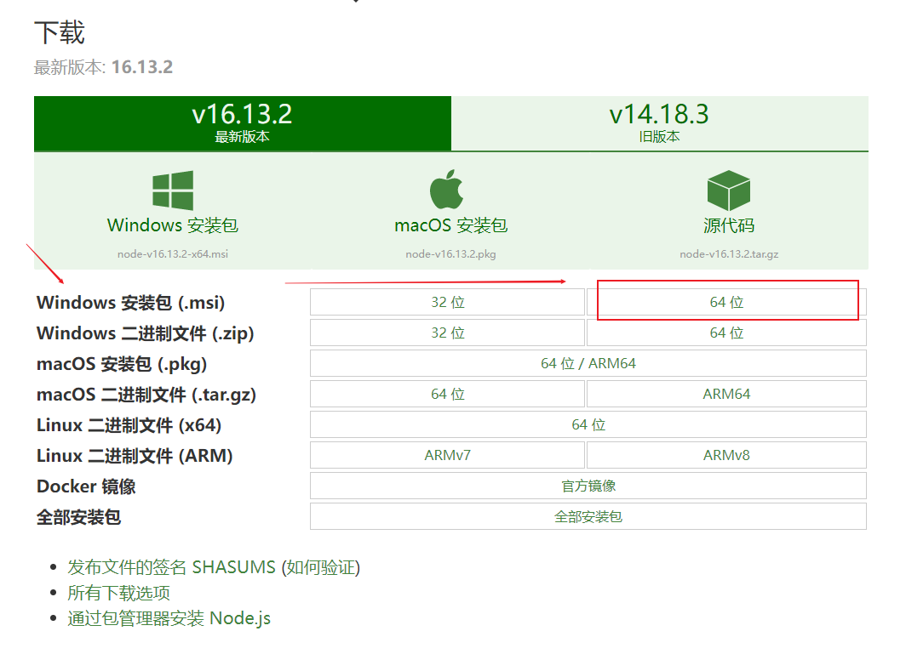
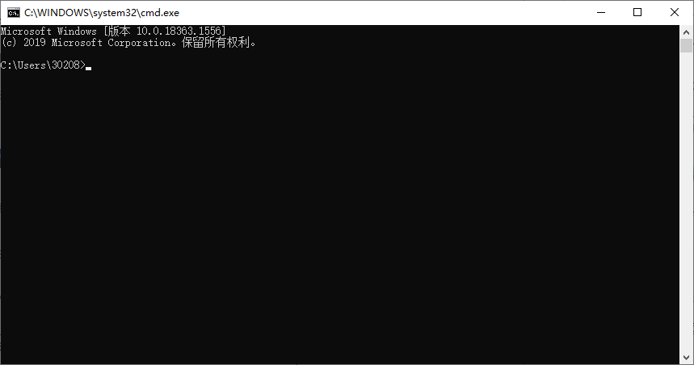

> 由于个人使用需要，仅展示`windows`上的安装说明。

## 1.官网下载Node.js

- <a link="http://nodejs.cn/download/">Node.js中文官网下载</a>

对应安装环境(操作系统)选择最新版本下载即可，这里下载的是windows-64位的`v16.13.2`版本的Node.js。



下载完安装包后，直接运行下载安装即可，除了`安装路径`自定义以外，其它部分一路`Next`，直到`Finish`即可。

以上版本安装包安装完成之后，`Node`会自动添加`系统路径`，大家不必再特意去添加啦。

接下来，我们通过`命令行(cmd)`来验证一下`Node.js`是否已经安装完好。

## 2.验证Node.js安装情况

> 这里针对`Windows`进行演示，其它环境类似。

首先按下`Win`+`R`键，打开**搜索框**，然后在搜索框中输入`cmd`，再按下回车(`Enter`)即可。

> PS: 这里是先按下`Win`键，再按下`R`键哦~


接下来映入眼帘的`黑框框`就是`Windows`上的命令行窗口啦。



我们接下来使用这样的一条命令即可完成`Node.js`安装的基本验证——这里只是验证是否可以正常启动哦，至于`下载换源`我们后边再说。

```bash
# 输入以下命令行指令，以验证安装的Node.js版本
# node: Node.js的本地调用名称
# -: 指令引导符号
# v: 输出版本信息的指令
node -v
```


我们可以看到，我们安装成功啦，命令行在本地是可以运行的。

通过以上步骤的话，接下来就可以使用`npm工具`进行我们的`docsify`文档利器下载啦~

> `npm`没有介绍是因为它随`Node.js`已经包含了，而且后期**主要用于下载**，所以不做过多解释哦——如果有`linux`/`python`等基础，可以理解成`sudo apt`/`pip`这样的下载工具。

